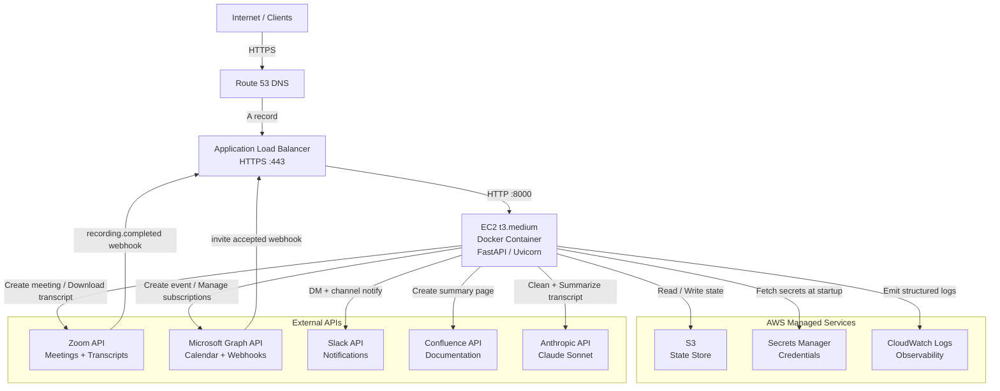
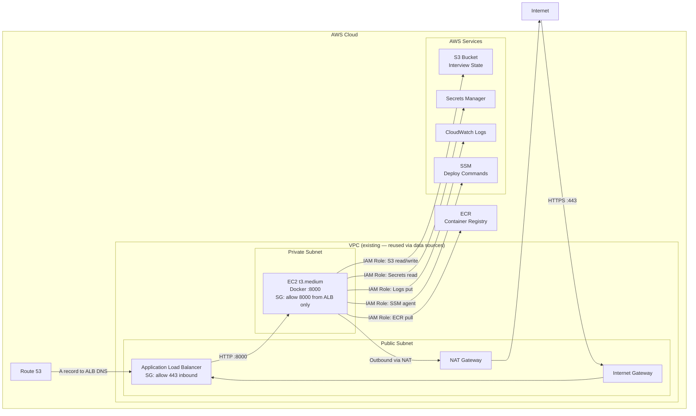
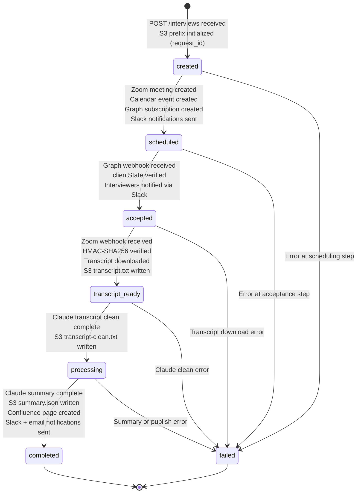
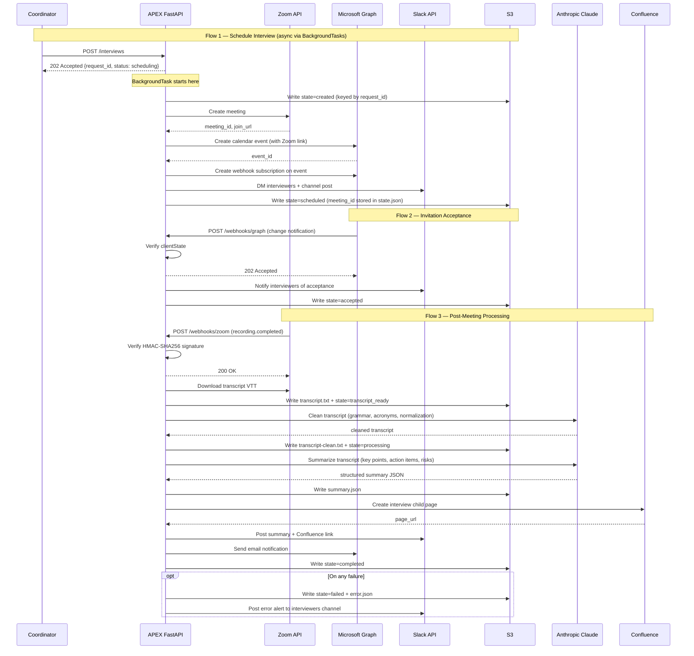

# Diagrams — APEX Interview Automation Bot

---

## 1. High-Level Architecture

```mermaid
graph TD
    Internet["Internet / Clients"] -->|HTTPS| R53["Route 53 DNS"]
    R53 -->|A record| ALB["Application Load Balancer<br/>HTTPS :443"]
    ALB -->|HTTP :8000| EC2["EC2 t3.medium<br/>Docker Container<br/>FastAPI / Uvicorn"]

    subgraph AWS["AWS Managed Services"]
        S3["S3<br/>State Store"]
        SM["Secrets Manager<br/>Credentials"]
        CW["CloudWatch Logs<br/>Observability"]
    end

    EC2 -->|Read / Write state| S3
    EC2 -->|Fetch secrets at startup| SM
    EC2 -->|Emit structured logs| CW

    subgraph External["External APIs"]
        ZoomAPI["Zoom API<br/>Meetings + Transcripts"]
        GraphAPI["Microsoft Graph API<br/>Calendar + Webhooks"]
        SlackAPI["Slack API<br/>Notifications"]
        ConfluenceAPI["Confluence API<br/>Documentation"]
        AnthropicAPI["Anthropic API<br/>Claude Sonnet"]
    end

    EC2 -->|Create meeting / Download transcript| ZoomAPI
    EC2 -->|Create event / Manage subscriptions| GraphAPI
    EC2 -->|DM + channel notify| SlackAPI
    EC2 -->|Create summary page| ConfluenceAPI
    EC2 -->|Clean + Summarize transcript| AnthropicAPI

    ZoomAPI -->|recording.completed webhook| ALB
    GraphAPI -->|invite accepted webhook| ALB
```

---

## 2. AWS Infrastructure

```mermaid
graph LR
    subgraph AWS["AWS Cloud"]
        R53["Route 53"]
        ECR["ECR<br/>Container Registry"]

        subgraph VPC["VPC (existing — reused via data sources)"]
            subgraph Public["Public Subnet"]
                IGW["Internet Gateway"]
                ALB["Application Load Balancer<br/>SG: allow 443 inbound"]
                NAT["NAT Gateway"]
            end
            subgraph Private["Private Subnet"]
                EC2["EC2 t3.medium<br/>Docker :8000<br/>SG: allow 8000 from ALB only"]
            end
        end

        subgraph AWSServices["AWS Services"]
            S3["S3 Bucket<br/>Interview State"]
            SM["Secrets Manager"]
            CW["CloudWatch Logs"]
            SSM["SSM<br/>Deploy Commands"]
        end
    end

    Internet["Internet"] -->|HTTPS :443| IGW
    IGW --> ALB
    ALB -->|HTTP :8000| EC2
    EC2 -->|Outbound via NAT| NAT
    NAT --> Internet

    EC2 -->|IAM Role: S3 read/write| S3
    EC2 -->|IAM Role: Secrets read| SM
    EC2 -->|IAM Role: Logs put| CW
    EC2 -->|IAM Role: SSM agent| SSM
    EC2 -->|IAM Role: ECR pull| ECR

    R53 -->|A record to ALB DNS| ALB
```

---

## 3. Interview State Machine

```mermaid
stateDiagram-v2
    [*] --> created : POST /interviews received<br/>S3 prefix initialized (request_id)

    created --> scheduled : Zoom meeting created<br/>Calendar event created<br/>Graph subscription created<br/>Slack notifications sent

    scheduled --> accepted : Graph webhook received<br/>clientState verified<br/>Interviewers notified via Slack

    accepted --> transcript_ready : Zoom webhook received<br/>HMAC-SHA256 verified<br/>Transcript downloaded<br/>S3 transcript.txt written

    transcript_ready --> processing : Claude transcript clean complete<br/>S3 transcript-clean.txt written

    processing --> completed : Claude summary complete<br/>S3 summary.json written<br/>Confluence page created<br/>Slack + email notifications sent

    completed --> [*]

    created --> failed : Error at scheduling step
    scheduled --> failed : Error at acceptance step
    accepted --> failed : Transcript download error
    transcript_ready --> failed : Claude clean error
    processing --> failed : Summary or publish error

    failed --> [*]
```

---

## 4. End-to-End Sequence

```mermaid
sequenceDiagram
    participant Client as Coordinator
    participant API as APEX FastAPI
    participant Zoom as Zoom API
    participant Graph as Microsoft Graph
    participant Slack as Slack API
    participant S3
    participant Claude as Anthropic Claude
    participant Confluence

    Note over Client,S3: Flow 1 — Schedule Interview (async via BackgroundTasks)

    Client->>API: POST /interviews
    API-->>Client: 202 Accepted {request_id, status: scheduling}
    Note over API: BackgroundTask starts here
    API->>S3: Write state=created (keyed by request_id)
    API->>Zoom: Create meeting
    Zoom-->>API: meeting_id, join_url
    API->>Graph: Create calendar event (with Zoom link)
    Graph-->>API: event_id
    API->>Graph: Create webhook subscription on event
    API->>Slack: DM interviewers + channel post
    API->>S3: Write state=scheduled (meeting_id stored in state.json)

    Note over Graph,S3: Flow 2 — Invitation Acceptance

    Graph->>API: POST /webhooks/graph (change notification)
    API->>API: Verify clientState
    API-->>Graph: 202 Accepted
    API->>Slack: Notify interviewers of acceptance
    API->>S3: Write state=accepted

    Note over Zoom,Confluence: Flow 3 — Post-Meeting Processing

    Zoom->>API: POST /webhooks/zoom (recording.completed)
    API->>API: Verify HMAC-SHA256 signature
    API-->>Zoom: 200 OK
    API->>Zoom: Download transcript VTT
    API->>S3: Write transcript.txt + state=transcript_ready
    API->>Claude: Clean transcript (grammar, acronyms, normalization)
    Claude-->>API: cleaned transcript
    API->>S3: Write transcript-clean.txt + state=processing
    API->>Claude: Summarize transcript (key points, action items, risks)
    Claude-->>API: structured summary JSON
    API->>S3: Write summary.json
    API->>Confluence: Create interview child page
    Confluence-->>API: page_url
    API->>Slack: Post summary + Confluence link
    API->>Graph: Send email notification
    API->>S3: Write state=completed

    opt On any failure
        API->>S3: Write state=failed + error.json
        API->>Slack: Post error alert to interviewers channel
    end
```
